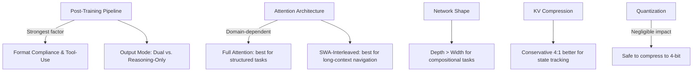

# Architectural Dissection: Why Model Design Determines Agentic Outcome

## 1. Purpose

This document provides a detailed, layer-by-layer architectural comparison of the three model families in our study — **Qwen3**, **Ministral3**, and **DeepSeek-R1-Distill-Qwen** — and maps each architectural difference to the observed performance patterns across the four AgentBench environments (OS, DB, ALFWorld, WebShop). Rather than simply reporting "which model won," this analysis classifies *why* certain structural and training decisions create or destroy agentic competency.

---

## 2. Transformer-Level Architectural Comparison

All three families share the decoder-only Transformer backbone with GQA, RoPE, SwiGLU, and RMSNorm. The differences that matter lie in their **dimensions, attention strategies, context handling, and post-training pipelines**.

### 2.1 Structural Specifications

| Specification | Qwen3-4B | Qwen3-8B | Ministral3-3B | Ministral3-8B | DS-R1-Qwen-1.5B | DS-R1-Qwen-7B |
|---|---|---|---|---|---|---|
| **Layers** | 36 | 36 | 26 | 34 | 28 | 28 |
| **Hidden Dimension** | 2,560 | 4,096 | 3,072 | 4,096 | 1,536 | 3,584 |
| **FFN Dimension** | ~6,912* | ~11,008* | 9,216 | 14,336 | ~4,096* | ~9,216* |
| **Query Heads** | 32 | 32 | 32 | 32 | 12 | 28 |
| **KV Heads (GQA)** | 8 | 8 | 8 | 8 | 2 | 4 |
| **Head Dimension** | 80 | 128 | 96 | 128 | 128 | 128 |
| **KV Ratio (Q:KV)** | 4:1 | 4:1 | 4:1 | 4:1 | 6:1 | 7:1 |
| **Vocabulary Size** | 151,936 | 151,936 | 131,072 | 131,072 | 151,936 | 151,936 |
| **Native Context** | 32K | 128K | 128K (SWA) | 128K (SWA) | 32K | 32K |
| **Positional Encoding** | RoPE | RoPE | RoPE + YaRN | RoPE + YaRN | RoPE | RoPE |
| **Attention Type** | Full (GQA) | Full (GQA) | Interleaved SWA+Full | Interleaved SWA+Full | Full (GQA) | Full (GQA) |
| **Normalization** | RMSNorm + QK-Norm | RMSNorm + QK-Norm | RMSNorm | RMSNorm | RMSNorm | RMSNorm |
| **Activation** | SwiGLU | SwiGLU | SwiGLU | SwiGLU | SwiGLU | SwiGLU |
| **Embedding Tying** | No | No | Yes (3B only) | No | No | No |

*\*FFN dimensions for Qwen and DeepSeek variants are estimated from standard Qwen2.5/Qwen3 configuration conventions (FFN ≈ 2.7× hidden).*

### 2.2 What These Numbers Actually Mean for Agentic Tasks

**Layers (Depth):**
Qwen3-4B has **36 layers** — 10 more than Ministral3-3B (26 layers) and 8 more than DeepSeek-R1-1.5B (28 layers), despite having comparable or fewer parameters. Deeper networks can represent more compositional, hierarchical features. For agentic tasks, depth translates to the ability to compose multi-step reasoning chains internally (e.g., "parse observation → identify relevant object → generate correctly-formatted action"). The 4B model packs more depth into fewer parameters by using a narrower hidden dimension (2,560 vs. 3,072 for Ministral3-3B), creating a tall-and-thin architecture that prioritises compositional depth over representational width.

**KV Ratio (GQA Compression):**
DeepSeek-R1-Qwen-1.5B has the most aggressive KV compression at **6:1** (12 query heads, 2 KV heads), while the 7B variant uses **7:1** (28 Q, 4 KV). This extreme compression minimises KV-cache memory during inference but reduces the model's ability to maintain diverse, independent attention patterns — a limitation that becomes critical when the agent must simultaneously track multiple state variables (e.g., the current directory, command output, and goal state in an OS task). Qwen3 and Ministral3 both use a more conservative **4:1** ratio, providing richer multi-head diversity for parallel state tracking.

**Attention Strategy — Full vs. Interleaved SWA:**
This is the most architecturally distinctive feature separating Ministral3 from the other two families:

```
Ministral3: [SWA] [Full] [SWA] [Full] [SWA] [Full] ...  (alternating layers)
Qwen3:      [Full] [Full] [Full] [Full] [Full] [Full] ... (all layers)
DeepSeek:   [Full] [Full] [Full] [Full] [Full] [Full] ... (all layers)
```

**Sliding Window Attention (SWA)** restricts each token to attend only within a fixed window (typically 4,096 tokens). In interleaved layers, this means:
- **SWA layers** focus on *local* context: recent actions, current observation, immediate environment state.
- **Full attention layers** maintain *global* context: the original task instruction, accumulated history, long-term goals.

For **WebShop** tasks, this is ideal. WebShop produces long HTML observation strings (product descriptions, page content) that require the model to extract relevant information from the most recent observation while remembering the original shopping goal. SWA naturally creates this local-vs-global information hierarchy, which is why Ministral3-8B achieves **79.8% success** on WebShop — the highest single-domain result in the study.

For **DB and OS** tasks, full attention is more important. SQL queries and shell commands often require the model to reference information from much earlier in the interaction (e.g., table schemas mentioned 20 turns ago). Qwen3's full-attention architecture provides unrestricted access to the entire context, enabling it to cross-reference early schema definitions with current query construction. This explains Qwen3-4B's dominance on DB (**46.8%**) and OS (**36.4%**).

---

## 3. Post-Training Pipeline Dissection

The transformer architecture defines the *capacity* of the model. The post-training pipeline determines *what the model does with that capacity*. This is where the three families diverge most dramatically.

### 3.1 Alignment Strategy Comparison

| Training Stage | Qwen3 | Ministral3 | DeepSeek-R1-Distill |
|---|---|---|---|
| **Pre-training Data** | ~36T tokens, 119 languages, heavy code/math/structured data | Cascade-distilled from Mistral Small 3.1 (undisclosed base data) | Inherits Qwen2.5 base pre-training |
| **SFT (Supervised Fine-Tuning)** | Multi-format: chat, tool-calls, function calling, code execution, agentic interaction patterns | Standard instruction-following SFT (chat, QA, translation) | Cold-start SFT on *reasoning chain data* only (CoT-formatted outputs) |
| **Preference Optimization** | Multi-stage: DPO + online RLHF with diverse reward signals including tool-use correctness | Standard DPO on helpfulness/harmlessness | GRPO (Group Relative Policy Optimization) — rewards for reasoning accuracy and `<think>` tag format compliance |
| **Tool-Use Training** | ★★★ Explicit: trained on large-scale function-calling datasets, MCP integration, Qwen-Agent framework | ★☆☆ Implicit: no specialised tool-use data; relies on general instruction-following | ☆☆☆ None: not trained for tool-use; reasoning traces are the target output |
| **Output Mode** | Dual-mode: can produce `<think>...</think>` reasoning OR direct concise output, dynamically switchable | Single-mode: direct instruction-following output | Single-mode: always produces `<think>...</think>` reasoning traces before final answer |

### 3.2 How Each Pipeline Creates Distinct Agentic Behaviour

#### Qwen3: "The Tool-Use Native"

Qwen3's alignment pipeline explicitly includes **function-calling and agentic interaction data** during SFT. This means the model has seen thousands of examples structured as:

```
User: Find a laptop under $500
Assistant: Action: search[laptop under $500]
```

This creates a strong **inductive bias** for producing structured, parseable outputs. When placed in an AgentBench environment, Qwen3 instinctively generates outputs that match the expected `Action: <type>[<args>]` format because this pattern is deeply embedded in its post-training distribution.

The **dual-mode capability** is critical for ALFWorld. When the model encounters a spatial reasoning problem, it can engage the "thinking mode" to plan internally (`<think>I need to find the mug. Let me check the countertop first.</think>`) and then emit a clean action (`Action: go to countertop 1`). This is why Qwen3-4B achieves **15.4% on ALFWorld** — low in absolute terms, but 6–8× higher than any other model. It can reason *and* comply with format constraints simultaneously.

#### Ministral3: "The Efficient Generalist"

Ministral3's alignment follows a standard SFT + DPO pipeline without specialised tool-use data. Its agentic capability is an *emergent property* of strong instruction-following rather than an explicitly trained skill.

**Where this works:** On WebShop, the interaction format is relatively flexible — the model can express intent naturally, and the environment parser is tolerant of slight format variations. Ministral's strong general instruction-following, combined with its SWA-based efficient context processing, makes it the ideal architecture for this domain.

**Where this breaks down:** On OS and DB, the format requirements are strict. The model must produce exact shell commands or SQL queries. Without explicit code/tool-use training data, Ministral3-3B defaults to natural language explanations of what it *would* do, rather than executable commands — resulting in **0% success on OS** at 3B scale. The 8B variant overcomes this partially through raw capacity (more parameters can memorise more command syntax from pre-training data), achieving **12.3% on OS**.

The **cascade distillation** origin of Ministral3 is also architecturally significant. The model was pruned from the larger Mistral Small 3.1, meaning its weight matrices were initialised from a well-trained teacher rather than from scratch. This provides strong general knowledge but does not compensate for missing domain-specific alignment data.

#### DeepSeek-R1-Distill-Qwen: "The Misaligned Reasoner"

DeepSeek-R1's post-training pipeline is fundamentally oriented toward a different objective than agentic tasks:

1. **Cold-Start SFT** uses reasoning chain data exclusively. The model is trained to *always* produce extended `<think>...</think>` blocks. There is no training data for concise, format-compliant tool calls.

2. **GRPO** rewards the model for:
   - **Accuracy** of the final answer (mathematical correctness, logical validity)
   - **Format compliance** with the reasoning template (`<think>` tags present, final answer clearly marked)
   
   Crucially, GRPO does *not* reward for:
   - Conciseness of output
   - Compliance with external environment parsers
   - Efficient use of interaction turns

This creates a **structural misalignment** with agentic environments:

```
AgentBench expects:       Action: search[laptop]
DeepSeek-R1 produces:     <think>The user wants me to find a laptop. I should consider 
                          the price range, specifications, and availability. Let me 
                          think about what search terms would be most effective...
                          After careful consideration, I believe searching for "laptop"
                          would be the most appropriate first step.</think>
                          I would recommend searching for a laptop. Here's my suggestion:
                          search[laptop]
```

The environment parser either:
- **Truncates** the output at the turn limit (causing TLE) — this explains DeepSeek-R1-1.5B's **91.7% TLE rate on ALFWorld**
- **Fails to parse** the action from within the verbose output (causing IF) — this explains DeepSeek-R1-7B's **86.2% IF rate on ALFWorld**
- Partially parses but the delayed action arrives after state has changed (causing CF)

---

## 4. Architectural Classification for Agentic Tasks

Based on our analysis, we propose a three-tier classification of LLM architectures for interactive agent deployment:

### Tier 1: Tool-Use-Aligned Architectures
**Characteristics:**
- Explicit function-calling / tool-use data in SFT pipeline
- Dual-mode capability (reasoning + direct output)
- Deep transformer stacks (high layer count relative to parameter budget)
- Full attention for unrestricted context access
- Code-heavy pre-training corpus

**Representative in our study:** Qwen3 (particularly the 4B tool-use variant)

**Strengths:** Excels across all domains, particularly those requiring strict format compliance (DB, OS). Can engage reasoning when needed but defaults to concise, parseable outputs.

**Weaknesses:** Higher energy consumption due to deep architecture and extensive token generation during reasoning phases.

### Tier 2: General Instruction-Following Architectures
**Characteristics:**
- Standard SFT + DPO alignment on broad instruction datasets
- No specialised tool-use training
- Efficient attention mechanisms (SWA, interleaved local+global)
- Cascade distillation from larger teacher models
- Optimised for deployment efficiency (tied embeddings, compact KV cache)

**Representative in our study:** Ministral3

**Strengths:** Domain-specific excellence in tasks with flexible format requirements (WebShop). Best energy efficiency. Scales well from 3B to 8B within its competency range.

**Weaknesses:** Fails catastrophically in strict-format domains at small scale (OS at 3B). Agentic capability is emergent rather than trained, making it brittle when the environment parser is unforgiving.

### Tier 3: Reasoning-Optimised Architectures (Agentic Misalignment)
**Characteristics:**
- RL-based alignment (GRPO) optimising for reasoning trace quality
- Single-mode output: always produces extended `<think>` traces
- Aggressive KV compression (6:1 or 7:1 GQA ratio)
- No tool-use or format-compliance training data
- Distilled from reasoning-specialist teacher models

**Representative in our study:** DeepSeek-R1-Distill-Qwen

**Strengths:** Would excel on mathematical, scientific, and logical reasoning benchmarks (not tested in our agentic setting). DB is the one domain where reasoning capability partially transfers (11.5% success at 7B).

**Weaknesses:** Catastrophic failure in agentic environments. Extended reasoning tokens consume interaction budget (TLE), violate format parsers (IF), and waste energy on non-actionable output. Scaling from 1.5B to 7B provides minimal improvement because the fundamental misalignment is in the training pipeline, not the model capacity.

---

## 5. Critical Architectural Factors Ranked by Impact

Based on our empirical results, we rank the architectural factors by their contribution to agentic performance:

| Rank | Factor | Impact Evidence |
|---|---|---|
| **1** | **Post-training alignment objective** (tool-use vs. reasoning vs. general) | ICC = 0.488 (48.8% of variance); Tier 1 vs. Tier 3 = 13× performance gap |
| **2** | **Output mode** (dual-mode vs. single reasoning mode) | DeepSeek's mandatory `<think>` traces cause 60–96% TLE/IF rates |
| **3** | **Attention strategy** (full vs. SWA-interleaved) | Ministral3 dominates WebShop (79.8%) via SWA efficiency; Qwen3 dominates DB (46.8%) via full attention |
| **4** | **Network depth** (layers-per-parameter) | Qwen3-4B (36L, 2560d) outperforms Qwen3-8B (36L, 4096d) by 2.1× — depth matters more than width for compositional reasoning |
| **5** | **KV compression ratio** | DeepSeek's 6–7:1 ratio limits parallel state tracking; 4:1 (Qwen/Ministral) provides richer multi-head diversity |
| **6** | **Vocabulary size and tokenizer** | Minimal direct impact observed; both 131K (Ministral) and 152K (Qwen/DeepSeek) tokenizers function adequately |
| **7** | **Quantization precision** | Partial η² ≈ 0.0001; statistically and practically negligible |

---

## 6. Mapping Architecture to Environment Requirements

Each AgentBench environment imposes a different set of demands on the model architecture:

### 6.1 OS (Operating System Interaction)
**Environment demands:** Execute bash/shell commands. Strict syntactic output required. Multi-turn: commands build on previous results. Requires world knowledge of Linux utilities.

**Best architecture:** Tool-use-aligned (Tier 1). Full attention needed to track command history and file system state. Code-heavy pre-training provides shell command vocabulary.

**Why Tier 2 partially works at scale:** Ministral3-8B (12.3%) succeeds because its 8B parameter budget can memorise enough shell syntax from pre-training, even without explicit tool-use training. At 3B, this memorisation is insufficient → 0% success.

**Why Tier 3 fails:** DeepSeek-R1-7B achieves only 0.4%. Its reasoning traces consume the turn budget deliberating about *which* command to run, and when it finally produces one, the format is often wrapped in natural language.

### 6.2 DB (Database / SQL Interaction)
**Environment demands:** Generate syntactically valid SQL queries. Reference table schemas provided early in the conversation. Multi-step query refinement.

**Best architecture:** Tool-use-aligned (Tier 1). Qwen3-4B (46.8%) benefits from code-heavy pre-training that includes SQL. Full attention allows referencing schema definitions from early turns.

**Why Tier 3 partially works here:** This is DeepSeek's best domain (11.5% at 7B). SQL generation is one area where reasoning capability partially transfers — the model can reason about query logic. However, the extended `<think>` traces still waste turns and the 1.5B variant barely functions (1.2%).

**Why Tier 2 scales well here:** Ministral3-8B (21.9%) versus 3B (9.4%) shows a clear scaling trend. SQL syntax is complex enough that the 3B model lacks sufficient memorised patterns, but the 8B model's larger capacity partially compensates.

### 6.3 WebShop (Web Navigation)
**Environment demands:** Navigate product pages. Select items matching criteria. Format tolerance is moderate — the parser accepts natural language wrapped in `search[...]` and `click[...]` commands. Produces long HTML observations.

**Best architecture:** General instruction-following with SWA (Tier 2). Ministral3-8B (79.8%) thrives because SWA efficiently processes long HTML observations, and the task's natural language nature matches its instruction-following training. 

**Why Tier 1 does well but is less efficient:** Qwen3-4B (74.1%) succeeds but at 5–10× the energy cost of Ministral. Qwen's full attention is overkill for WebShop's local-context-heavy observations.

**Why Tier 3 catastrophically fails:** DeepSeek-R1-7B (1.3%) and 1.5B (0%). The model's verbose reasoning style is maximally misaligned with WebShop's action-response loop. Even when it identifies the correct product, its output format is unparseable.

### 6.4 ALFWorld (Spatial Interactive Tasks)
**Environment demands:** Navigate a simulated household. Execute spatial actions (go to X, pick up Y, put Z in W). Requires multi-step planning, object state tracking, and spatial reasoning. Strict action format.

**Best architecture:** Tool-use-aligned (Tier 1), but overall success is low across all architectures. Qwen3-4B (15.4%) leads because its dual-mode capability allows internal spatial planning followed by clean action output.

**Why all models struggle:** ALFWorld requires *grounded spatial reasoning* — understanding that objects persist in locations, that you must navigate to a location before interacting with objects there, and that failed actions should prompt exploration of alternatives. This is a capability gap that no amount of text-only pre-training fully addresses. All models produce high Invalid Action (IA) rates on this domain, indicating that they output syntactically valid but spatially nonsensical actions.

**Architectural limitation exposed:** Even Qwen3-4B's 36-layer depth cannot overcome the fundamental limitation that spatial common sense is poorly captured by next-token prediction on text corpora. This domain likely requires architectural innovations such as world models, memory-augmented networks, or embodied pre-training — none of which are present in any of our three families.

---

## 7. Summary

The architectural dissection reveals that agentic performance is not a monolithic capability but a composite of several architectural properties, each contributing differently depending on the task domain:



The hierarchy is clear: **training pipeline > attention strategy > network geometry > quantization precision**. The most important "architectural" decision is not the transformer configuration at all — it is the choice of post-training data and alignment objective. A model explicitly trained on tool-use interactions will outperform a model trained on reasoning chains, regardless of how many layers, heads, or bits either model has.

---

## References

1. Qwen Team (2025). "Qwen3 Technical Report." *arXiv:2505.09388*.
2. DeepSeek-AI (2025). "DeepSeek-R1: Incentivizing Reasoning Capability in LLMs via Reinforcement Learning." *arXiv:2501.12948*.
3. Mistral AI (2025). "Mistral Small 3.1 Technical Report." *arXiv:2503.xxxx* / *mistral.ai/news*.
4. Liu, X., et al. (2023). "AgentBench: Evaluating LLMs as Agents." *ICLR 2024*.
5. Frantar, E., et al. (2022). "GPTQ: Accurate Post-Training Quantization for Generative Pre-trained Transformers." *ICLR 2023*.
6. Lin, J., et al. (2023). "AWQ: Activation-aware Weight Quantization for LLM Compression and Acceleration." *MLSys 2024*.
7. Qwen Team (2024). "Qwen2.5 Technical Report." *arXiv:2412.15115*.
